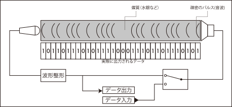

<!---
ただ、デジタルという行為を考えると伝達そのものであり、記憶することそのものでもあることがわかる
つまり、内容はなんでも良いんだけど、なんでも良いということはなんでも変換して保存するためのプロセスが存在して、それは記憶装置の仕組みごとに異なる

結局序論の時の状態に戻って、アーティストとしての自分と、メディア考古学研究者としての自分を分けないとうまくいかないのかもしれない

トポスのような文化的言及が発生するならば、同じ時代の中で似たような文化的要請が現れ、ある視点では全く同じ仕組みとも言えるテクノロジーが出てくる（技術としてのトポス）ことがあるのではないだろうか？

つまり、デジタルテクノロジーの発達でやってきたことは巨視的にに見ていくと音声入力とかそういうのが続いた結果まさしく車輪の再発明を行っている、というようなことを考えていたのだと思う

音響遅延先端上の背景→2章に移動
-->
# 序論

筆者は卒業制作として、音響遅延線メモリーというコンピューターの初期に使われていた記憶装置を題材にした音響装置作品の制作を行った。
音響遅延線という装置の概要については本論で述べることにするが、一連の制作においてはすでに淘汰され使われなくなったメディア装置、その中でも特に記憶装置を取り上げ、現代の技術を取り込み別のメディア装置として再生させるという作品制作のプロセスを取った。

## 動機と問題意識

今日、デジタルネイティブという言葉が存在するように我々が何か技術を使うときにアナログ、デジタルと言う境目を意識することは少なくなったように思える。また、それに伴い「保存する」ことと「通信する」事の境界は曖昧になりつつ有る。

例えば、MicrosoftのWordに代表される文書作成ソフトをWebブラウザ上で動作させるようにしたGoogle Docs[^googledoc]では書き込んだデータはリアルタイムでサーバに送信され自動で保存され、さらに共同編集をしている場合自分以外の書き込みも逐次反映されていく。ここで、手紙の紙＝保存メディアの発展形であったはずのGoogle Docsはもはや手紙という行為そのもの＝通信にもなっている。そしてこれらを使うとき、石版や紙のような媒体の物質性は意識されず、人間同士のやり取りだけが意識される。
このような時代においてそもそも情報を保存する、伝えるとは一体どういうことなのだろうか？

情報を保存するというのは、その前提に伝えるということがあって始まるのだが、通信技術の発達と計算機の性能向上によって、わざわざ一度保存せずとも、速く遠くに伝えることができるようになってしまった。それでは何を目的として何の情報を保存する必要があるのだろうか？

作品を作る直接的な動機がこのような理由であったかと問われれば、はじめは音が機構に含まれている記憶装置という単純な構造の面白みに惹かれ制作を始めただけだと答えることになるだろう。
しかし、コンピューター黎明期に使われた「通信し続けることで保存する記憶装置」をである音響遅延線を可聴音を使い復元させるという制作の作業、音響遅延線に関する資料探し、そしてこの考察も含めた行為の中で上記のような疑問や興味はより強まっていったのは確かである。

[^googledoc]: Googleの提供する、ウェブブラウザ上で動作する文書作成ソフト。Wordなどの既存のフォーマットを扱うこともできる。元々2005年にUpstartle社のWritelyというWebサービスから始まり2006年にGoogleが買収しGoogle Documentとなった。共同編集機能はサービス開始当初からの特徴であった。[https://www.google.co.jp/intl/ja/docs/about/](https://www.google.co.jp/intl/ja/docs/about/)

## メディアアートをどう考察するべきか？

筆者は「メディアアート」と呼ばれる領域に興味を持ち、自分の制作以外にもメディアアートと呼ばれるもののサウンドプログラムの開発などを行なってきた。
そのため本論考においても本卒業制作を「メディアアート」としての作品についての考察を行いたいと考えている。すなわち「この作品はメディアアートの文脈の中でどういう位置づけにあるか？」という問いに答えなければいけないが、これには様々な困難がつきまとう。そもそもメディアアートとは何か？という問いに対して統一された見解のようなものは今も昔も存在しているとは言えないからである。

本論考に於いては日本におけるメディアアートの歴史をまとめる数少ない試みの内の一つである、2014年に発行された馬定延『日本メディアアート史』を作品考察のための重要な資料として用いた。

## メディア考古学という学問アプローチ

さて、メディアアートと呼ばれるものの作品考察、あるいはメディアアート史といったものを考えるにあたって一つのヒントとなる学問のアプローチが有る。今回の制作では「すでに淘汰されたメディア装置を研究し、別の形のメディア装置を作り上げる」というプロセスを取った。それに類似した、メディア考古学と呼ばれる学問のアプローチ法がある。メディア考古学とは、考古学という名前が付いているものの特定の学会が存在するわけでは無く、アプローチ法と書いたように学問のプロセスそのものを指す言葉であり、1980年代頃からいくつかこの名前がメディア研究において使われ始めた。メディア研究者のエルキ・フータモなどが現在における代表的な研究者である。その方法自体も具体的に確立されてるわけではなく、研究者ごとに微妙に異なっているのだが、日本のメディア研究者であり、フータモの著書を訳した太田純貴は

>メディア考古学を最大限一般的にしたかたちで定義すれば、「日々増殖するメディアテクノロジーによって、埋没してしまったメディア文化やそれがもたらす経験についての言説の掘り起こし」であり、「大半のメディア考古学者たちに共通するのは、メディア文化についての規範的で正統的な物語を突き抜けて「掘り下げて」、省かれたものや的外れに終わった解釈を指摘すること」とまとめることができるだろう。

と述べている[@ohta:mediaarch]。
フータモは論文内にて積極的にメディアアートと呼ばれるモノを取り上げる[@huhtamo:mediaarcheology]。メディア考古学と呼ばれる言葉の存在する以前から、メディア考古学的アプローチを取り続けているアーティストが存在すると言うのだ。本章では先程挙げた「日本メディアアート史」での考察法ににおいて用いられた「作品が作られる舞台となった施設やイベント、社会的状況を中心にメディアアートの歴史を考察する」というアプローチを参考にし、メディアアートと言われる領域全体を考察する上での視点についてもメディア考古学的アプローチと言うものが考えられるということをまず指摘し、メディアアート史の考察を如何に行うべきか考察してから、さらに卒業制作《送れ｜遅れ / post｜past》そのものに対してもメディア考古学的アプローチでの制作という視点でどのように考察できるかを考えていく。

## 本論考の構成

以上の前提を元に、本論考は、以下のように構成される.

1. 序論(本章)
1. 音響遅延線メモリーという装置について
1. 卒業制作《送れ｜遅れ / post｜past》について
1. 制作手順と技術的解説
1. メディア考古学的メディアアート史考察
1. メディア考古学的メディアアート制作考察
1. まとめ

第2章においては、まず前提知識として卒業制作の題材となった装置である音響遅延線の技術解説と、それが作られた時代背景について解説する。

第3章において、卒業制作作品の全体的な解説を、3年次において制作した《Acoustic Delay (⇔) Memory》との違いの比較を交え行う。

第4章においては、実際の制作の進行の記録と、作品のシステムとしての詳細な技術的解説及びそこに用いられた技術についての解説を行う。

第5章において、「メディア考古学的アプローチ」がメディアアートの歴史、文脈考察においてどのように関わるかを考察し、本作品の考察をそもそもどう行うべきかという議論をする。

第6章においては、「淘汰された装置を掘り起こす」という作品制作のプロセスについて、「メディア考古学的アプローチ」が作品制作とどう関わっていたかについて考察する。

第7章にて、メディアアート制作とメディアアート史を考える場合において「メディア考古学的アプローチ」がどのように適用できるのかを改めてまとめ、結びとする。

# 音響遅延線メモリーという装置について

本章では、卒業制作作品及びその前作で中心的に取り上げられた装置である「音響遅延線メモリー」についての装置の基本的な仕組み、使用され始めてから淘汰されるまでの簡単な歴史的背景について説明する。また作品制作の動機の一つとなった、他のデジタル記憶装置に比べて根本的な仕組みが特異であることについて触れる。

## 概要

音響遅延線メモリー(Acoustic Delay line memory)という装置は1950~1960年頃の、初期電子計算機（いわゆる「コンピューター」）に使われていた記憶装置である。
世界初のコンピュータ、というのは定義によって諸説あるのだが、一般的にそうと言われているENIACの次の世代として作られたアメリカのEDVAC(1951年)やイギリスのEDSAC(1949年)、UNIVACⅠ、また日本で最初の商用コンピュータであるFUJICでも使用されている[@ipsjmusium]。

開発者はENIACの開発にも携わっていたジョン・プレスパー・エッカートとジョン・モークリーであるが、はじめに導入予定であったEDVACでは特許関係で開発が遅れ、それより先に公開されていたEDVAC開発のための指針[^foredvac]に影響を受けたEDSACが先に音響遅延線を採用したコンピュータとなった。また、ENIAC完成より前の1944年の時点で音響遅延線メモリは仕組みとして提案されており、1947年にエッカートとモークリーの名前で特許が申請され、1953年に受理されている[@eckert1953memory]。

[^foredvac]: 一般に言われる、ノイマンの「EDVACのための第一草稿/FIrst Draft of a Report on the EDVAC」の事。ENIACの様に問題ごとに配線を変更するのではなくプログラム自体をメモリに読み込んだ上で動作させる、現代の殆どのコンピュータで採用されている「プログラム内蔵方式コンピュータ」の最初のアイデアとして語られるので、この方式はノイマン方式とも呼ばれるが、実際には原稿の名前がノイマンであっただけでENIAC共同開発者のエッカートとモークリーも同様の方式のコンピュータ制作のために活動していたことがわかっている。参考文献[@von1993first]。

## 技術解説

音響遅延線メモリーは{+@fig:adm}のように、水銀で満たしたタンクと、その一端に取り付けられたピエゾ素子のマイクロフォン、反対の端に取り付けられたやはりピエゾ素子のトランスデューサー（スピーカー）、及び増幅（波形整形）回路、入出力の制御回路から成り立っている。

時間を一定間隔で区切り、その間に超音波のパルスを発する/発しないを保存したい二進数データの1/0に対応させ、スピーカーから出力する。超音波のパルスは水銀中の音速、1451.4 m/sで伝わりマイクまで到達する。マイクで検出した信号を、回路の中で、パルスが存在すれば1、存在しなければ0という処理を施すと元々送信した二進数データが復元される。それをもう一度同じスピーカーに送信すると、同じデータ列が循環し続けることとなる。最大で保存できるデータは区切る時間の間隔（データの送信レート）、マイクとスピーカー間の距離、音速を決定する温度に依存する。

{width=100% #fig:adm}

音波の媒体として水銀を使っているのは送信、受信に使われるピエゾ素子との音響インピーダンスが近い事によって、マイクでの受信時に反射波が生じにくく、データにエラーが少ない、エネルギー効率がよい事が理由である。

音響遅延線メモリーのデータの保存容量を増やすためにはパルスの間隔を短くすること、マイクとスピーカー間の距離を長くする、タンクを増やすのいずれかになる。そして読み出し、書き出しの速度もパルス間隔に依存し、計算自体に使う電気的な0/1の波形の速度よりは大幅に遅くならざるを得ず、仕組み上性能向上に限界が存在していた。
また、温度によって音速が変化してしまい、データの送信レートが変化してしまうので温度を一定に保つ仕組み(恒温槽)が必要になり、物理的に装置が巨大化せざるを得ないという欠点もあった[^fujic]。

[^fujic]: ただし日本のFUJICでは独自に恒温槽をなくし、読み出し速度を温度に依存して変化させることで逆転的に対応しシステムの簡略化を図っていた。

## 誕生から淘汰されるまでの時代の技術的移り変わり

EDVACに先行するENIACでは、回路を手でパッチを組みつなげることによりプログラムを構成していた。その為計算する問題を変える際は毎度パッチを組み替えないといけないなどの問題があった。
この問題点を解決するために記憶装置にプログラム自体を読み込み動作させるという方式が考え出されたが、その実現にはある程度高速かつ大容量な記憶装置の開発が求められていた。ENIACに搭載されていた一時的に値を保存する記憶措置（レジスタ）は真空管を使い論理ゲートを構成しており、その保存容量はわずか10進数20個分であった。当時の真空管は熱によりすぐ焼き切れるため安定性としても欠けていたため、真空管の数を増やして対応するわけにもいかなかった。
当時記録装置として使われていたものと言えば、紙に穴を開けた箇所で記録するパンチカードシステムや、電磁石で電気的にスイッチをオン・オフするリレーがあったが、パンチカードは機械的に動かすために真空管などの電子的スイッチに比べると動作速度が遅く、計算途中で命令をパンチカードから読み込むたびに計算が長時間止まってしまうという問題点があった（もちろん、電気の速度と比べればで実際には僅かな時間なのだが、ENIAC以前の計算機との差異はまさにその圧倒的な高速性であったため、計算が機械的な構造によって遅くなってしまうのは致命的であった）。
リレーも機械的にスイッチを動かすために、パンチカードよりは早いもののあまり高速動作させると熱によって誤動作を起こすため速度には限度があった。
そこで、「電子的メモリーよりは遅いが機械的メモリーよりは早い」記憶装置として提案されたものの一つが音響遅延線メモリーであった。この時期その他の記憶装置のシステムとしては陰極線管を利用したウィリアムス管メモリーなどが存在する[@invent_computer]。
その後1953年にWhirlwind[^whirlwind]の改良に、音響遅延線よりは高速かつランダムアクセス（後述）可能な磁気コアメモリが採用され、その後は半導体のメモリ（SRAMやDRAM）に取って代わられていった。

[^whirlwind]: 初めて磁気コアメモリを搭載したイギリスのコンピュータ。一度の計算の精度を落とすことで高速化を図った。

## 技術的特異性

音響遅延線メモリーは他の記憶装置と比べて大きな特徴を持っていると筆者は考えている。それは「通信し続けることで記憶装置としての機能を持つ」という点である。
記憶装置同士の比較や、カテゴリ分けには主に

1. データのアクセス方法(直接アクセス/逐次アクセス)
2. 読み出し時にデータを保持できるか（破壊/非破壊）
3. 揮発/不揮発(電源が無くともデータを保持できるか)
4. 書き換え可能か否か
5. 容量

などが主であるが、個別の装置を細かく見ていくとどれとも当てはまりづらい項目が幾つか出て来る。
例えばデータアクセス方法の例で考えてみる。
記憶装置のアクセス方式は大きく分けて

1. 直接アクセス/Random Access
1. 逐次アクセス/Sequencial Access

とされることが多い。

直接アクセスは現在使われているハードディスクやフラッシュメモリ、磁気コアメモリなどが当てはまり、物理的に保存されているデータの位置に関わらず任意のデータを指定して読み出すことができる。
逐次アクセスは磁気テープやパンチカードのような媒体が当てはまる。はじめからデータを順番に読み出さないと任意のデータまでたどり着くことが出来ないタイプのものである。

ここで、ハードディスクドライブはデータのアクセス方法は一般的にはランダムアクセスに分類されるが、空き領域が連続している場合は連続した位置にデータを保存し、その場合読み出し法はシーケンシャルアクセスとなり読み出し速度が早くなる、といった微妙な例が出てくる。

またそもそも1962年の論文では

1. 循環アクセス/Cyclic Access

という三つ目の分類が存在しており、音響遅延線メモリや磁気ドラムメモリ[^jikidrum]のようなデータが常に循環し続けるものについてはこちらに分類されている[@ishii:memory]。

さて、上のカテゴリの中でわかりやすくカテゴリ分けしたときの音響遅延線メモリーの特徴は「揮発性かつ逐次/循環アクセスのみ」であると言えるだろう。
この２つを兼ね備える記憶装置は現状出てきたメモリの中では遅延線メモリの類にしか無いのだが、何故そうなるのかに目を向けることで本当の違いが見えてくる。
どういうことかというと、上に挙げたカテゴリ分けは、記憶装置として利用する場合に関わってくるカテゴリ分けであって保存ができる仕組みそのものはそれが表出するための条件でしかないということである。
何故遅延線メモリだけが２つの特徴を兼ね備えるかと言うのが、「通信し続けることで記憶装置としての機能を持つ」という動作原理に起因するのである。
同じ循環アクセスだが不揮発の磁気ドラムメモリは磁気ドラムの磁気極性＝物質の状態を変化させる事で記録を行うので不揮発になり、同じ揮発性だがランダムアクセスのDRAMはコンデンサに溜まっている容量＝やはり物質の状態を変化させ、固定することで記録をしている。
一方で遅延線メモリは水銀の疎密という物質の状態を変化させているものの、その状態は固定されることがなく、疎密が伝搬しつづけいる。一つの記憶装置の中で情報を循環させ続ける、通信をし続ける事によって保存される場合にのみ揮発性かつ循環アクセスのみという利用上の特徴が表出するのである。

[^jikidrum]: 円盤の外側部分に強磁性物質をコーティングしてその極性を変化させる事で記録する装置。ハードディスクと仕組みは似ているが、読み書きのヘッドは磁気テープの様に一箇所に固定し動かす必要が無いので、装置の仕組みとしてより簡素であった。

## 誕生の背景

さて、そのような特異な装置に対しての資料を探した中で一つ興味深かったのは、開発者自身が音響遅延線メモリーという装置の仕組みにたどり着くまでである。

開発者であるジョン・プレスパー・エッカートへのインタビュー(1988年、スミソニアン協会により、国立アメリカ歴史博物館で行われた)の中で音響遅延線メモリーの仕組みについて解説している場面である。これは《送れ｜遅れ / post｜past》の展示の際、会場入り口で配布したインストラクションとなる文章にも抜粋して掲載した。

> エッカート:例えば、水銀で満たされたタンクがあるとしよう。1000発のパルス音を片方の端から入れて、反対側の端から漏れ出てしまう前までは、それはメモリーと呼べるだろう。
問題は1ミリ秒後のことだ。もしパルスが1マイクロ秒ごとに一つづつタンクから出ていってしまえば、それでお終いだ。しかしここでこのパルスを毎回取り出して、もう一度元の形に整形してもう一度戻したとしたらどうだろう。パルスは言ったとおりに循環し続け同じ状態を保つ。

> インタビュアー: ということはその記憶装置は水銀の動きで保存していると？

> エッカート: 水銀を伝わる波によって保存しているんだ。水銀は動かずそのままだが、弾性波がその中を通り抜けていく。水銀の分子の前後に動き続ける。そして波はその中を伝搬していく。これをどうやって思いついたと思う？小さい頃のことを思い出そう。買い物に行く時に、母親が私にあれやこれを4~5個買ってきて欲しいと頼んでくる。それを書いてメモするのではなく、多分同じような小さい子供はみんなそうすると思うが、母親に送り出されてから店につくまでの道のり中ずっとその5つのことを自分の中で繰り返し自分に言い聞かせる。
こうすると若い私の短期記憶は店につく頃には長期記憶になっている。同じ原理だ。
音響遅延線も水銀のタンクの中に詰めて電気回路を通して戻して循環させている。私たちはこのタイプのメモリーを使って最初のUNIVAC、UNIVACⅠを作り上げた。

[@eckertinterview]

このインタビューについては作品制作の途中段階で既に読んでいたが、中間発表展示終了後の継続した調査の中でさらに発見したものが以下の二つである。

一つは1953年時点、EDVAC稼働後のエッカート自身による記憶装置のシステムについてまとめたサーベイで、先程のインタビューと似たような記述が見られる。

> 遅延線メモリーの基本的仕組みはシンプルだ。情報のパターンが遅延媒体の中に挿入される。遅延媒体の終点から最初の場所へパターンを増幅回路とタイミング調整回路を通した上で引き戻してやると、パターンの循環の閉ループが成立する。簡単に説明すると、遅延線メモリーの仕組みは誰かに電話をかける時に、電話帳にあった電話番号をダイアルを回すまで頭のなかで繰り返し続けているときの短期記憶と等しい。

[@eckert1953survey]このように、エッカートは音響遅延線の仕組み自体を人間の行為の比喩として説明している。

更に幾つかの記述を探すとエッカートの人生についてインタビューを交えまとめた記事[@eckstein1996j]があり、この中で興味深い記述が見られる。

音響遅延線メモリーの歴史については2章であらかた説明したが、そもそも音響遅延線ははじめからメモリーとして開発されたわけではなくはじめは軍事用のレーダーに映り込むノイズ（移動しない物体）を取り除くために、単純な信号遅延処理、時間の計測のデバイスとして用いられた。
当初はベル研究所のウィリアム・ショックレー（後にトランジスタの開発者の一人として知られる）らが研究をしており、不凍液[^futou]の中に超音波のパルスを片方の端から発し、反対側には反射板を持たせ、パルスの往復する時間を利用していた。しかしパルスが反射して戻ってくるときには減衰と歪が大きくなってしまうという問題があり、それを研究に加わったエッカートがまず不凍液ではなくより重い液体である水銀を使うことを提案した。それに加え反対端に反射板ではなくマイクロフォンを取り付け、トランスデューサーにフィードバックすることでより長時間の計測が可能になった。

[^futou]: 水とエチレングリコールの混合物で、主に車のエンジンの冷却液などが氷点下において凍りつかないように使用される。

ここにエッカート自身のバックグラウンドが大きく関わってくる。エッカート自身は子供の頃からラジオを改造したりするところから工学への興味や知識を深めていっている。さらに音を光の明滅に対応させて2点間で音を送るための仕組みを開発したりしている（彼が21歳の頃特許を申請し、2年後に受理されている[@presper1942light]）。これらのことから彼が音に対しての興味を強く持っていて、遅延線の改良にもこの知識が大きく役立っていたと記されている。
さらに同記事内、晩年1992~1995年のインタビューの中での発言が記事の中で抜き出されている。

> パルスを戻して整形してからもう一度出力するんだ、丁度私が子供の時に買い物に行ったときのようにね。

同記事内のそれより前の部分で子供時代についての記述があり、エッカートが小さな子供の頃から父親が非常に教育に対して厳しかったことが書かれている。その中の具体的なエピソードの一つとして、買い物に行かせる時にリストをメモするのはなく頭のなかで繰り返し言い続けさせるようにしていた事が挙げられていた。これは短期記憶を長期記憶にする、記憶トレーニングのようなものの教育の一環として行われていた。このことからはじめに挙げたインタビューでの比喩は彼自身の実体験をベースに話していたことが確認できる。

一連の記述をまとめると、エッカートが音響遅延線を開発する際には子供の頃の記憶トレーニングの経験がヒントとなって遅延線を反射型からフィードバック型にするアイデアに至ったということは言えるだろう。

ただ、この記述からは「時間計測の装置」から「記憶装置」に遅延線を転換利用する際にもこの経験が影響していたかどうかまでははっきりと言えない。

それでも一連の発言やエッカートのバックグラウンドを総合してみると音を使った記憶装置である音響遅延線メモリーの完成には彼が音楽やラジオに対する興味を強く持っていたことや、幼少期の体験が大きく影響したと言えるのではないだろうか。

さて、本作品を制作する段階ではエッカートが音に対しての興味を持っていたことや、彼の例えが実体験に基づくものであったかどうかの確証がないまま制作を行っていた。

筆者の興味は伝達することと記憶/記録の等価性についてである。つまり誰かに情報が伝わらなければ情報を保存したことにはなっていないのではないか、ということであり、その状況が装置の根本的な原理としてシンプルに現れているのが音響遅延線メモリーであると製作段階でも考えていたし、この論考を書いている今もそう考えている。
その為はじめにアメリカ歴史博物館でのインタビューを読んだ時にこの比喩は正しくないのではないか、という感想を抱いた。これは展示会場で配布した文章に書いてある事そのままなので直接載せたいと思う。

>この例えはあまり適切ではありません。この例えはどちらかと言えば陰極線管テレビジョンに同じ映像を長時間映すとその映像が焼き付いてしまうというのに似ていて、ある現象を反復することで物質的な変化が生じ固着するというものです。音響遅延線は一度でも情報の伝達が遮断されればたり、電源が切れればたちまち情報は消えてしまいます。と言ったものの、人間だって電源が切れれば保存されている情報は取り出せないので、似たようなものだと言われるとそれもまあ間違いではないかもしれません。

この文章を書いた当時（展示開始前日の2016/11/3だったと記憶している）はエッカートの比喩が正しいのかどうかに疑問を持ったまま制作を続けていた。つまり音響遅延線のシステム自体は短期記憶がひたすら繰り返されているだけで長期記憶に転換しているわけでは実際にはないという点をどう咀嚼するべきかで大きく悩んだ。
結局のところ後半で書いているように、作品において現代の状況で音響遅延線メモリーの仕組みが音声入力と読み上げを使って同じような現象が起こせるという拡大解釈的な提示の仕方を自分もしていて、エッカートの解釈もそのような拡大解釈の一種だったのではないか、と考えることで納得することにした。

しかし今になってエッカートの発言が実体験に基づくものであり、音響遅延線という一風変わった仕組みの装置が開発される背景に製作者の子供時代の記憶トレーニングであったり音に対する関心があったことは結果的に作品のコンテクストを補強する一つの事実にはなったのかもしれない。（順番変えたので、ここちょっと変えたい？）

# 作品概要

## 前作品《Acoustic Delay (⇔) Memory》について

本作品は前年2015年に制作した《Acoustic Delay (⇔) Memory》に続く要素が多く含まれるので、本作品の説明に入る前に前作品について説明する。

### 展示の基本情報

- 期間 : 2015年12月12、13日
- 会場 : 東京芸術大学千住キャンパス 倉庫2(音楽環境創造科の制作・研究発表会、千住 Art Path 2015において)

### 作品概要

《Acoustic Delay (⇔) Memory》は標準的なスピーカーとマイクロフォン、簡単な電子回路及びコンピュータを使用して構成された音響装置作品である。

回路はトランジスタでの標準的なロジックICのみを使用し1950年代に使用された音響遅延線とほぼ等価な回路を構成している。
それによりマイクとスピーカーの間の遅延時間で8bit（実際には、通信のためのスタートビットとストップビットをそのまま入れているため10bit）のデータを保存し続けている。
PCとは標準的なRS232の一般的なシリアル通信で読み出しと書き込み（上書き）ができるようになっている。展示中はWeb上にインターフェースが用意してあり、保存されているデータ列8bitのAsciiコードに対応した文字が表示される。右側には8つの長方形が並び、ビットの1/0が白・黒の色に対応して表示されている。
直接その部分を編集しキーボードで文字を打ち込み、Enterキーを押すか長方形をクリックするかでデータを書き込む事もできる。
これは直接USBで接続されているPCからだけでなく、同じURLを開けば携帯電話からでも世界中どのコンピュータからでもデータの読み/書きができる。
すなわちこの音響遅延線は一種のクラウドストレージのような機能を持つ。

また、もちろん保存されているデータは音として循環し続けているので、マイクとスピーカーの間に立って経路を遮ったり、手を叩くなど大きなノイズが発されればデータは変化してしまう。

{width=65%}

{width=65%}

## 卒業制作《送れ｜遅れ / post｜past》の解説

### 展示の基本情報

- 期間 : 2016年11月4、5、7、8、9日
- 会場 : 東京芸術大学千住キャンパス第7ホール
- 照明 : 松島州伸、陣内薫
- 記録撮影 : 野口翔平
- 協力 : 阿部壮志、笠原眞由、黒石紗弥子、竹本水花、辻百合香、増田義基、渡辺千加

### 作品概要

本作品は《Acoustic Delay (⇔) Memory》に続く作品として、より音響遅延線というシステムを拡大解釈したシステムを展示した。

本作品は{+@fig:fukan}に示すとおりの5台のコンピュータにより構成されるが、その役割は二台、二台、1台に分けられる。しかし個々のコンピュータは独立したプログラムによって制御され、LAN等のネットワークを介してお互いのコンピュータを制御することはない。

まず、PC1と2は二台で一つの音響遅延線としての機能を持つ。
PC1は1kHzに乗せてスピーカーから信号を送信し、PC2のマイクが1kHz上の信号を受信する。受信したデータと全く同じデータをPC2は4kHzに乗せてスピーカーから発信する。PC1はマイクから4kHz上の信号を受信し、また同じデータを1kHzに乗せて送り返す。
こうすると、ノイズや遮蔽物などが無い限り同じデータを保持し続ける。
PC2は更にデータの書き込み機能を備えている。PC2の画面の右側にはGoogle Docsが開かれており、左側にはドキュメント上の文字が一つずつ区切られて表示されており、クリックすることで二つまで選択できる。画面下側にあるwriteボタンをクリックすると二つの文字をUTF-16でデコードしたビット列として上書きして送信する。

PC3は、PCの内蔵マイクでPC1の発する信号を読み取り、データに変化があったのを検知するとそれを2文字のUTF-16にエンコードし画面上に表示する。またそれがMac OSの標準読み上げ機能で読み上げ可能だった場合読み上げる[^3_real]。

[^3_real]: 実のところは、展示期間5日間中で文字を表示するようになったのは2日目から、文字が正しくデコードを始めたのは3日目午後からであった。それでもPC1で書き込んだデータをそのまま表示することは一度もなかった。これについては技術的解説において考察する。

PC4と5は1や2と同様にそれぞれ独立したプログラムが稼働していて、マウスやキーボードなどの操作が自動化されている。
PCにはGoogle Docsで共通した書類が開かれている。まずPCの内蔵マイクで、一定の音量を検知すると、Google Docs上の音声入力ボタンをクリックする。
音声区間が終了すると再び音声入力ボタンをクリックし、音声入力を終了する。その後、ドキュメント上の文章をすべて選択し、それをMac OS上の標準読み上げ機能を使い読み上げる。
こうすることで、タイミングが合うとPC4が読み上げた文章をPC5で音声入力でドキュメント上に入力し、それをPC5が読み上げ再びPC4が音声入力し…という状態が繰り返される。

{#fig:fukan width=90%}

{width=90%}\ 

## 比較と考察

《Acoustic Delay (⇔) Memory》と《送れ｜遅れ / post｜past》における大きな違いは「装置の分離」にあると考える。
比較の単純さのために後者のPC1,2の部分を取り出して考えると、それぞれの部分はスピーカー、マイク、オーディオインターフェース[^audiointerface]、PCが結線されており、PC1とPC2はハードウェア的に完全に分離されている。
つまり、個別の装置は受け取ったデータを送り返すだけの通信装置として機能する。
しかし二台の装置がそれぞれ同じデータを送り返し続けることで同じデータが保持され、結果的に記憶装置としての機能が成立する。
本来的に音響遅延線という装置も同じデータを受取り送信し続けることで記憶装置としての機能を持っていた。しかしそれは一台のハードウェアの中での通信であり、外見を見ればやはり1つの装置でしか無い。
しかし通信の繰り返しでデータの保存ができるという根本的な原理を考えると装置が二台以上に分離していても同じ機能を作ることが可能であり、その状態こそ通信と記憶の曖昧な状態を作り出すことが可能だと考え、二台に分けることにした。

[^audiointerface]: コンピュータから音声を入出力するための装置。

# 《送れ｜遅れ / post｜past》 制作手順と技術的解説

## 実際の制作スケジュール

- 6月:音響遅延線をテーマに作品制作を決定
- 7月:使える技術についての検討、無線通信技術や海中音響通信技術などの勉強
- 8月:適応フィルタ、低レイテンシーハードウェアの検証など
- 9月:千住キャンパス第7ホールで展示することを決定、音声入力と読み上げを使ったシステムも入れることを決める
- 10月:後半は第7ホールでの実地検証、読み上げシステムの実装
- 11月:展示

## 制作に用いられた技術

### 音響遅延線メモリー部分

#### 信号処理のブロック・ダイヤグラム

{+@fig:adm2diagram}に示すのが音響遅延線部分の信号処理の概略図である。より詳しい実装は付録に記載した。

{width=75% #fig:adm2diagram}

#### 位相偏移変調

装置が二台二つに分かれるにあたって、従来の音響遅延線の仕組みをそのまま使おうとすると、マイクから受信した時に相手の信号と自分が発信した信号が混ざってしまうという問題点がある。今回はそれを二台の装置での使用周波数帯域を変更することで混線しないようにした。
周波数を変更するための変調方式には、載せる搬送波の振幅に信号を対応させる振幅偏移変調(ASK)、周波数変化に対応させる周波数偏移変調(FSK)、位相の変化に対応させる位相偏移変調(PSK)、振幅と位相を両方変化させる直行位相振幅変調(QAM)など様々な方式があるが、今回はQPSK、もしくは4QAM[^qam]と呼ばれる、2bitのデータを位相の45°、135°、225°、315°の4状態に割り当てる方式を採用した。

[^qam]: 位相状態の変化はコサイン波とサイン波の振幅の組み合わせで表せる。正弦波の位相が45°、135°、225°、315°だとすると、コサイン波、サイン波の振幅はそれぞれ(1,1)、(-1,1)、(-1,-1)、(1,-1)と表せる。実際の実装ではこの1と-1を0/1のビットに対応させている。

{width=100% #fig:qpsk}

{+@fig:qpsk}のように、基準となる位相から45°、135°、225°、315°がそれぞれデータの00、01、10、11に対応する。

#### 実際の実装方法

主な実装には関数型音声処理言語のFaust(Functional-AUdio-STream)を利用した。
Faustはフランスの音響研究機関、GRAMEの開発した言語であり、サンプル単位でのデジタル音声信号処理を非常に抽象的に記述することや、一度C++[^C++]にコンパイル(変換)されてからスタンドアロンアプリケーション、Cycling'74 Max[^max]やPuredata[^puredata]、VSTプラグイン[^vst]など様々な環境上で動作させることができるという特徴を持つ。またテキストで記述するがシグナルブロックの接続を画像として出力することもでき（画像参照）、実際のコードの構造を視覚的に確認しながら開発を進めることが可能である。

今回はほとんどの音声処理部分をFaustで記述し、Cycling'74 Max上でリアルタイムにコンパイルできるFaustgen~という環境を使用した。Maxは主に波形の確認等デバッグや、ブラウザとのPC内でのUDP通信のためのインターフェース用に使われた。
Faustを選択した理由としては構想当初の段階でスマートフォン上のブラウザや音声入出力の遅延の少ない小型コンピュータ（Bela[^bela]）上で動作させることも想定しており、様々なプラットフォームでの同じ信号処理を共通したコードで使いまわせるというメリットが大きかったためである。
また、Maxのような処理ごとのブロックをグラフィカルに繋いでプログラムを作るものはそれゆえに処理の抽象化に限度があり、例えば幾つかのパラメータを変更した同じ処理ブロックを直列につなぎ、何個つなぐかを簡単に変更したい、という時にはその都度ブロックをつなげ直すか、メタプログラミングのような回避策が必要となる。
その点においてFasutは並列、直列、入れ子構造など様々な接続法において接続数を変える時にパラメータの変更のみで済むという面がある。
また基本的な発振器やフィルターなど信号処理のモジュールが基本ライブラリとして提供されており、その詳細なパラメータの追い込みもMaxやPuredataよりも詳細かつ簡潔に設定できるところも強みの一つである。[@Orlarey2004faust ; @smith2012signal]
結果的にはFaustはすべてMax上で動作させる形になったが、Faustで記述したコードは最適化された形でコンパイルされるため詳細な計測などはしていないものの比較的低負荷で動作させることが可能であったなど、幾つかのメリットはあったと考える。
今回の作品で実際に使用されたFaustのコードとMaxのパッチは付録として添付した。

[^C++]: 多くのアプリケーションの実装に使用されているプログラミング言語。
[^max]: オーディオ、ビデオなど様々なメディアを、オブジェクトと呼ばれるブロック同士をグラフィカルに繋いでいくことで簡単かつ高度なプログラミングができる環境。現在はCycling'74社から発売されている有料ソフトウェアで、フランスの電子音響研究所IRCAMで開発されたPatcherが元になっている。
[^puredata]: Max(Patcher)の開発者の一人であるミラー・パケットが開発するMaxを基に作ったMax同様のオープンソースのマルチメディアプログラミング環境。音声処理機能はこちらに先に作られたものがMSPとしてMaxに取り込まれた。
[^bela]: BeagleBoneBlackという小型Linuxコンピュータで、高機能な（入出力の遅延が非常に短い）オーディオ機能が扱える拡張ボードと専用OS。イギリスのクイーンズメアリー大学ロンドン校のCentre for Digital Music内Augmented Instrument LabのプロジェクトBeagleRTが基となって、Kickstarterで出資を募り販売されることとなった[@andrew2015a]。
[^vst]: Virtual-Studio-Technology。Steinberg社が開発キットを配布している、多数のオーディオ編集ソフト内で使えるエフェクトやシンセサイザー（VSTi）などの規格。同様の規格にAppleのAudioUnitやAvidのAAXなどがある。

#### 使える技術と使えない技術

今回、実装するにあたって使いたくとも作品のコンセプト的に使えないという技術があった。音響遅延線を普通のスピーカーとマイクを使って構成しようと思った時に発生する大きな問題の一つが、マルチパス（反射波＝残響）干渉だ。これは、信号がスピーカーからマイクへ直接向かうだけでなく、壁や床、天井などから反射してからマイクに入ることでもとの信号と少しだけ遅れた信号が混ざってしまう事によって、信号の検出にエラーが生じる問題である。もちろん、無線通信でも同様の問題が発生しているのでこれらの対策は存在する。幾つか方法はあるのだが代表的な方法はある程度の長さの既知信号を送り、反射波のパターンを特定し、それを打ち消すような波を生成する、適応フィルタと呼ばれる方法がある。
しかしこの方法は、打ち消したい残響時間がt秒あったとすると、残響が打ち消された信号が全体的にt秒遅れて出力されてしまう[@ochi:underwater]。
さて、これがただの無線通信ならばよいのだが音響遅延線メモリーという目的で使う場合には若干の矛盾が出てくる。デジタル信号処理でフィルタを作るということは、信号を複数の時間に遅延させて重ね合わせるような処理をするのだが、信号を遅延させるためには一度信号の値をコンピュータのメモリに書き込んでもう一度読み出すという作業を行わなければならない。
つまり「信号を遅延させることでメモリーを構成する」ことを目指しているのにそれを成立させるために「メモリーに書き込んで信号を遅延させる」ことが必要になってしまうのだ。それであれば、はじめからコンピュータのメモリに書き込んで、もう一度読み出すことでメモリーにを構成すれば良くて、遅延線メモリーを作る意味が全く無くなってしまうというジレンマが発生する[^fact1]。

[^fact1]: 実際、前作品と今回の違いのもう一つに、全ての信号処理をロジックICによるプリミティブな信号処理からPC上でのデジタル信号処理に変更したという事があるのだが、それによって、音を一度PCに取りこむ際にアナログ-デジタル変換、また信号処理後に音を出力する際にデジタル-アナログ-デジタル変換が行われていて、そこでも同様にメモリの書き込み、読み出しが発生するのでPCでの処理内で大きな遅延が発生しているのは事実である。

そもそも適応フィルタが遅延線メモリーほどにはリアルタイム性を強く追求しない技術だから当然ではあるのだが、全ての新しい技術が適用できて使えるわけではないことを痛感した。
結果としてマルチパス干渉は壁までの距離が遠くかつ吸音率の比較的高い第7ホールという場所を展示会場に選ぶことによって適応フィルタを使わずともある程度解決できた[^multipath]。
なお、適応フィルタを使わずにマルチパス干渉を避ける手段としては、パラメトリック・スピーカーなどの超指向性スピーカーを使用することでそもそもの反射波のエネルギーを下げることなどが考えられる。

[^multipath]: それでも、床からの反射音の影響が大きく、保存容量が32bitになるようなデータ送信レートに設定せざるを得なかった。なお、千住キャンパス音楽演習室2や3での実験時には干渉の影響が大きすぎてまともに保存することが出来ない状態であった。

### 音響遅延線データ上書き部分

PC2には{+@fig:adm_writer}のようなデータ上書きのためのインターフェースがPCの画面に表示されている。
画面右側にはブラウザが読み上げと音声入力の遅延線（次の項で説明）部分と同じURLのGoogle Docs文書を開いている。

{+@fig:writer_system}に示すのが、PC2で稼働するソフトウェア同士の関係を表した図である。
画面左側にはプログラムで作られたインターフェースがあり、右側の文書の中の文字が10秒間隔で取得され、それぞれ一文字ずつ区切られ表示されている。マウスで左側の文字をクリックすると、2文字までは反転して選択状態になり、下側にある「Write」ボタンをクリックすることで、2文字をUTF-16[^utf16]の文字コードでデコードし、16×2＝32個のビット(0/1)列のデータとして音響遅延線部分に上書き保存を試みる。

上書きのインターフェースはNode.js[^nodejs]で実装されていて、PCの中にローカルサーバを立ち上げブラウザでアクセスすることでインターフェースが表示される。writeボタンがクリックされるとデータをOSC[^osc]メッセージとしてCycling74'Maxに送信する。Max内でデータを受信するとFaustのプログラム上のパラメータを変更し、遅延線内にデータを挿入し上書きする。

[^utf16]: Unicodeという、統一した文字コードを作る規格の一つ。16ビット単位で一つの文字を構成する。Javascriptの標準内部文字コードに使われている。
[^nodejs]: Javascriptは本来ブラウザの中で使われるプログラミング言語だが、それを単体でサーバーの内部などで使うことが想定されている。

[^osc]: Open Sound Controlの略で、MIDIに取って代わるものを目指して作られた、音楽演奏データをネットワーク経由でコントロールをするためのプロトコル。現在はその汎用性の高さから音楽演奏データ以外に照明や映像のコントロールなどにも広く使われている。参考文献[@wright2003opensound]

{width=100% #fig:adm_writer}

{width=100% #fig:writer_system}

### 読み上げによる仮想遅延線メモリー

{width=100%}

{width=100% #fig:yomiage}

もう一つ、{+@fig:fukan}におけるPC4と5で行われている自動音声入力と読み上げ機能の実装について解説する。
使われている主要な機能は、Google Docs上の音声入力機能と、Macの標準音声読み上げ機能、読み上げとマウスの移動、キーボード操作を自動化するためのAppleScript[^applescript]、及び音声区間始まりの検出をするのと全体のロジックをコントロールするPuredataのプログラムである。
各PCでの基本的なロジックはこうである。

1. 一定音量の音声を検知するまで待機する。
2. 音声を検知したらGoogle Docs上の音声入力ボタンの座標をクリックする。
3. 音声が終了したのを検知したらもう一度同じ座標をクリックして音声入力を終わる。
4. ドキュメント上の全ての文章を選択する。
5. 選択した文章を読み上げる。
6. 1に戻る。

これが二台並んで動作することで、片方が読み上げた文章をもう片方が音声入力するという状況が出来上がる。
実際の運用では{+@fig:yomiage}のようにPuredataで音声区間の検出をトリガーにして、Puredata内でシェルコマンド[^shell]を実行できるオブジェクトを使用し、コマンドライン上からAppleScriptで予め作成した「ブラウザ上の任意の座標をマウスクリックする」コマンド、「ブラウザ上で任意のキーボードショートカットを実行する」コマンド、「クリップボード内のテキストを読み上げる」コマンドを呼び出す。
こちらでPuredataを利用したのは読み上げのためのApplescript実行と音声区間検出のためのロジックを一つのプログラムに統合できることが主な理由であり、Cycling'74 Maxでも不可能ではない[^max_2]。

[^shell]: OSをコマンドでコントロールするインターフェースのためのスクリプト。
[^applescript]: Macintoshの操作を自動化するためのスクリプト。シェルスクリプトよりもOSの実装に沿ったより細かい操作ができる。
[^max_2]: ただしMaxには標準でシェルコマンドを実行できるオブジェクトが入っておらず、aka.shellと呼ばれる外部オブジェクトを実行できる環境構築が必要である。Puredataではggeeという外部ライブラリのなかにshellオブジェクトが存在し、インストールもPuredata内で実行でき環境構築が素早く済む。

### 音響遅延線→読み上げ部分

{width=100%}

最後にPC3の部分は、PC1と2で構成されている遅延線のデータを自動的に受信し、そのデータの変化を検知するとそのデータをUTF-16にエンコードし、画面上に文字を表示するとともに、読み上げを試みる[^yomiage]。
データの検知に使用されているプログラムはPC1,2で使用されているMaxとFaustの組み合わせで、内部のプログラムもほぼ共通している。
データの変化を検知したところでMax上でそのデータをOSCメッセージとしてNode.jsのプログラムに送り、受信したデータをUTF-16でエンコードしブラウザ画面に表示するとともに、読み上げのシェルコマンドを実行する。

{width=100%}

[^yomiage]: 全部が読み上げられるわけではない。今回はMacの日本語での読み上げ（OtoyaとKyoko）を使用したため、日本語、英語、幾つかの記号と絵文字以外のハングル文字や中国語の漢字、アラビア文字などは読み上げられない。

### 展示中の実際とバグについて

11月の中間発表中の展示では実際に想定していたようにシステムが働かない場面があった。

#### 音響遅延線部分―位相同期の基準

先ほど説明した位相偏移変調という方式を取る場合、受信する際に受信機側で基準となる位相の正弦波を生成して、受信した信号との位相のズレを比較することで信号を復号する。このときの基準となる位相をどうやって送信側と同期するか？という問題がある。QPSK方式の場合、ズレが45°以内だった場合、復号した信号とビット判定前の差を基準正弦波の発振周波数に対してフィードバックすることでズレを補正することができる（PLL位相補償回路）。しかしこれが45°以上ズレている場合は補償することが出来ない。送信時の基準と位相が75°ずれているか25°ずれているかは既知の信号を送ることでしか判定のしようが無いのである。
適応フィルタでの説明と同じく、通常無線通信や海中音響通信では送りたいデータの前にある長さの既知信号を送ることでこれを補正するのだが、音響遅延線では既知のデータを挟んでいるほどの送信データ量の余裕がないため、結局90°以上のズレが発生した場合は手動で基準位相を変更できるようにし、定期的に直すという対処の方法を取った。

また、音響遅延線→読み上げ部分でも同様の問題は発生している。
しかもマルチパス干渉のため保存しやすいデータと保存しにくいデータが発生するため、writeボタンで保存しようとしたデータと違うデータの状態でパターンが安定するという状態がほとんどであった。しかもそれが90°以上ずれてPC3で受信されるというということも多々あったが故、「Writeで書き込んだ文字が保存されてPC3で表示される」という状況は結局一度も起きなかった。
その為、本当にデータが保存されているかどうかと言うのは音を聞いた感じ一定で変化がなく、静かにしていればPC3の文字も一定の文字を表示しようとするということでしか確かめようがなかった。しかも展示期間五日間の内PC3の受信部分にプログラムのミスがあり正しく同期をはじめたのは三日目の半ばであった。

#### 読み上げ部分

こちらはシステムの仕組み上そうならざるを得ないのだが、音声を検出してから音声入力のボタンを自動クリックするまでに多少の時間がいるため、読み上げた文字を入力しようとすると音声入力部分がはじめの言葉を認識することが出来ず、段々と読み上げる文章が短くなっていくという問題があった。しかし短くなるだけではなく、すべての操作をマウスのとキーボードのオートメーションで行っている事と、前に入力された文章を明示的に消去せず、全選択状態にしたまま音声入力をすることで前の文章を消去していたことから、タイミングがズレると文字の選択が解除された状態で音声入力が始まり文章が二重になったりすることで長くなっていく場合もあった。

# メディア考古学的メディアアート史考察法

本章においては、作品を考察するにあたってまずメディア考古学とは何か、そしてメディアアートと呼ばれるものの考察を如何になすべきかについてをメディア考古学的アプローチを手がかりに考えていく。

## メディア考古学とは

序論でも述べたように、メディア考古学とは特定の学問領域を指すのではなく学問のアプローチである。
まさに考古学という名前の通り、淘汰され既に使われることのなくなった、さらに言えば既に歴史の中で埋もれてしまい誰も知らないものになっていたものについての言及や資料を「掘り出す」ことで、新たな視点を生み出すというものである。
序論で引用した太田の定義に加えて共通する特徴を挙げるのであれば、メディアの歴史を語る際にはよく、何が技術的に新しかったかを挙げ、またそのテクノロジーが与えた文化への影響を考察する、と言った態度が取られる。これは裏返せば新しい技術が登場することによって新しい文化が作られていく、いわゆる技術決定論的な立場を暗黙的に取っている事が多い。
これに対してメディア考古学的アプローチを取るものは新しいメディア装置が生まれる際に何か文化からの暗黙的な要請によって新しくテクノロジーが生み出されることも含め、より技術と文化の発展の相互作用を注意深く精査する。また同時代での注目だけではなく、歴史上で文化的に同じような言及がされていたりしないかを調べたりなど、時代を横断することで歴史観を見直すこともある。

中心的な研究者として挙げられるのはエルキ・フータモ、ユシ―・パリッカ、ジークフリード・ツィーリンスキー、自分で名乗ることはないもののフータモらが引用することも多いフリードリヒ・キットラーやその教え子であるウォルフガング・エルンストなどが挙げられる。
正確にはアプローチが異なるというよりも、ツィーリンスキーが自分の研究を「anarcheology」(アナーキー考古学)と呼んだように、自らの領域を厳格に定義しない事自体がメディア考古学の特徴となっている。

今回筆者の作品の考察をするにあたっては、そのように微妙に異なるアプローチの中から、代表的な研究者であるエルキ・フータモと、聴覚文化（音響再生産、複製技術）への数少ないメディア考古学的アプローチの研究として挙げられている[@ohta:mediaarch]、ジョナサン・スターン『聞こえくる過去』[@o_audiblepast]のアプローチを主に参考とした。
両者の研究態度にももちろん違いは存在するので、簡単にその概要を述べる。

フータモは元々文学領域で使われる用語であった「トポス」概念を拡張し、様々な年代のメディアで現れる共通した文化的言及を探し出す。
例えば「妖精エンジンを分解する」と題した項で「機械のブラックボックスの中で働く"小人"という表現」を中心として「見えざる神の手」「その時背後では？」のようなメディア装置の広告だったり、風刺画の中などに現れる定形表現を見つけ出し、歴史に共通する人間のメディアに対する態度を表出させてるとも言えるし、ある共通した項目を抜き出した新しいメディア史の記述ということもできる。

スターンの記述は、「聞こえくる過去」に於いては「音響再生産技術(Sound Reproduction Technology)」、一般的にはレコードやテープなどの複製技術と呼ばれるものについての言及にとにかく集中しているものの、それをイヤー・フォノトグラフと呼ばれる時代的に音響再生産技術の始まる直前の物を取り上げたり、聴診器や、電信のような再生産以前の技術と交えて議論したり、レコードのような複製物と死に対する観念に集中して議論したり、とにかく多面的な考察がなされる。

## メディアアートは如何に考察されるべきか？

ここからはメディアアートと呼ばれるものとメディア考古学、そして本作品の関係についての考察を行いたい。

さて、「メディアアート」と「メディア考古学」を結びつけるとき、また今回のように作家が自身の作品について考察しようと思うと最終的に複数の結びつけ方が出てくる。

- メディア考古学的なメディアアート史の考察
- 作品を第三者が考察した時にメディア考古学的であったか
- 自身が制作の際に意識的にメディア考古学的なアプローチを取っていたか

やや煩雑にも見える関係だが、こうなるのは「メディアアート」と「メディア考古学」といった単純な比較のように見えてその間に「メディア文化」そのものが存在することによって複雑になるからであることと、「メディア考古学的」であることは自発的に考える場合もあれば結果的にそうなっているものもあるというフータモの捉え方が影響しているからである。
以下で順を追って説明していく。

### メディア考古学的なメディアアート史の考察

以上までの説明で筆者が「メディアアート」ではなく「メディアアートと呼ばれるもの」と書き続けているのは序論でも述べたように「メディアアート」という言葉の定義が非常に曖昧であるからである。
現状メディアアートと言っても元来の意味であった「ニューメディアアート」の文脈を引き継ぐ、いわゆる新しい技術（例えば2016年に於いてはバーチャル・リアリティやディープラーニングなどはそれらに当てはまるだろう）をアート作品に用いるものや、日本の代表的なメディアアートの美術館であるNTTインターコミュニケーションセンターでの年間展示「オープン・スペース」の2016年のタイトルが「メディア・コンシャス」であるように表現に関わるテクノロジーや素材（メディウム）が現代においてどういう文化的意味を持ちうるかについて意識的な態度を見せるものなど、幾つかの分類が可能なようにも見える。

しかしながら本論考では敢えてメディアアートの作品群を分類し、その中のどこに本作品が位置するか、のような言及の仕方は避けたいと考える。
なぜならそれら複数のジャンルに跨るものも当然存在するし、そのような線引きを行うことで見えなくなってしまう要素も存在すると考えるからである。

日本のメディアアート観に対する統一見解も未だまとまったものが存在するところではないが、馬定延「日本メディアアート史」などで幾つかまとめようとする試みは出てきている。
しかし「日本メディアアート史」でのアプローチは、一般的な美術史の様に代表的な作品を列挙するのではなく、背景的に起こった出来事（例えば大阪万博など）、セゾンや草月アートセンター、NTTのICCなど舞台となった場を中心として、メディアアートとは何なのかを探るようなアプローチとなっている。
このようなアプローチを取った理由について馬は序章においては

> 1970年代以降の日本のエレクトロニックアート紹介において、美術館における展覧会でなく、博覧会の名前が羅列されているのはなぜだろうか。なぜこれらの場を並べずには、日本のメディアアートの軌跡を語る事ができなかったのだろうか。

> こうした問題意識から、本書は個別の作家や作品ではなく、その背景をなす時代像に焦点を当ててみる。すなわち、本書はメディアアートの作品論と作家論を可能な限り排除して書かれたメディアアート史である。このような方法論が、究極的には、すべての表層的な要素、移り変わっていく背景を取り除いたあとに残る、メディアアートの本質たるものを強調することを目的にしていることは言うまでもない。

と述べているし、またあとがきにおいては本書中で挙げられた作品写真は本文で言及されていないものばかりかつ、作品の説明などはなく最低限の情報しか載せていないことに触れた上でこう述べる。

> 筆者の明確な意図は、これらの画像を通して、何がメディアアートなのかではなく、むしろその定義不可能性を提示し、読者に問いかけることである。

と、ある種明確にメディアアートの定義は不可能だと言い切っている。
実は本書は日本を代表するメディアアーティストである藤幡正樹についての研究から始まり、彼を中心として起きた出来事の歴史をまとめた論文が元になっていると本人も語っている[^ma1]。その為この本もかなり引いた目線で語っているとは言え視覚文化的に関わる要素の作家が中心に挙げられたり日本のメディアアートの全てを包括して語っているとは言い難い。

[^ma1]: 2015/12/12~13の千住 Art Path 2015(東京芸術大学千住キャンパス制作・研究発表展)での毛利嘉孝とのトークにおいて。またあとがきの最後でも遠回しであるが日本で研究する目的が藤幡について研究したかったから、ということを述べている。

しかしながら筆者はこの「引いた目線」、歴史を一つの観点で見定めようとせずに、起きた事象を冷静に見つめ、通底する物を引き出そうとする姿勢は「メディア考古学的アプローチ」と強く結びつくところがあると考える。その為本作品のメディアアートの中での位置づけを考える際の大きな参考の一つとしたい。

何が「引いた目線」がメディア考古学的視点と結びつくか、と言うのは特にフータモのメディア考古学観、中でも彼の言う拡張された「トポス」概念及び「メディアアーティスト」たちの捉え方である。

トポス概念とはもともと文学の中の常套句のようなものであり、メディア考古学を考察するにあたってフータモはこの概念を拡張している。
例えばバーチャル・リアリティにおける「没入感」などの言葉や「複雑な仕組みの機械の様子を表現するのに妖精や小人がマシンを動かしている比喩」などがある。
それを歴史を遡ったり、あるいは今現在現れているものと比べたりすることで、歴史的に通底する人間の欲望を見出したり、語られることのなかった歴史（例えばアーケードマシンなどを「メディア」として捉えたりなど）を紡ぎ出したりする。
そしてそれらを「メディアアーティスト」が意識的に行う場合もあるが無意識的に行われることもあるという。
なぜならトポスは使われるときはある目的を持って意図的に利用されるが、それが時代を超えて偶然に現れることもあるから、それを拾い上げた結果出来上がった作品が結果的に「メディア考古学的な」アプローチで作られている作品になるのだとフータモは主張する。

しかしこれは見方を変えれば、「メディア考古学」という言葉が出来上がったから初めて名がついたということでもあり、フータモのような研究者が名前を挙げなければ「メディア考古学的」でなかったことになると言える。

つまるところ、メディアアートと言うものを考察する際には作品だけで考察することは不可能で、それを取り巻く技術的な状況、文化的状況が、制作時どうであったかと考察時どうであったかということ抜きに語ることは出来ないということは言えるのではないか。もちろん、「メディア考古学的な」アプローチに自覚的でなく、しかも第三者が見た時にもそれが当てはまらない「メディアアート」もあり得るかもしれない。がそれが時代の変化でまた転換することもあり得る。さらに言えば「メディアアート」と本人が捉えていなくても「メディアアート」と言うことができる、という拡張もでき、これがつまり馬の言う「メディアアートの定義不可能性」なのではないだろうか？

もちろんこれはどんなアートでもメディアアートになりうるというような単純な議論ではないし、それはフータモが「メディア」という語の定義の拡張しすぎを「内爆発」を起こし「抜け殻」になってしまうと警鐘を鳴らす事とも通じる[^page]。「メディア」や「メディアアート」が作られた時代、それを捉える時代の関係性によってすぐ変節してしまうのであれば、そもそも時代を包括できる「メディア史」や「メディアアート史」を作ろうとすること、あるいはしばしば議論されるただただメディアアートとは何か？と言う禅問答のような議論自体がそもそも無意味なのではないだろうか。

[^page]: 参考文献[@huhtamo:mediaarcheology]77~78p。

さて、その為遠回りであったが次の章で本論考において作品を考察するにあたってのアプローチが先程挙げた三つのうち残りの二つになるのである。

上のようにメディアアートとしてこの作品を考察するのであれば2016年につくられたこの作品がメディア考古学的アプローチであったのかということの2016年における、（一般的な考察に比べればやや重点的に）技術と文化的背景から見た考察をすることがまず一つ。
それから、メディア考古学的アプローチということに自覚的になった上で制作したかどうか？ということがもう一つである。後者は筆者の、フータモの論述を読んだ上で出てきた疑問、すなわちフータモらがメディア考古学的と呼ぶ作品と自覚的にメディア考古学的に作られた作品に何か違いが見いだせるかという問いから設定した。

# メディア考古学的メディアアート制作考察

本章と次章においては文章の主体が「卒業制作を作ったアーティストとしての立場」の場合と、「メディア考古学の研究をする立場」、あるいは「メディアアートについて研究する立場」として俯瞰して自分の作品、あるいはそれを取り巻く環境について考察する場合とを本来分けて書くべきだが、調査を時系列的に並べるよりもトピックごとに分けるほうがわかりやすいと判断したため（あるいは、リサーチを行う段階においてどの立場で行っていたと分けきれない場合がもちろん存在するため）、様々な立場を混在して書かざるを得ないが、立場が変わる場合は出来る限り明示して表すことにする。

## デジタル記憶装置はメディア考古学で掘れるのか

まず、制作をするにあたって題材になった音響遅延線メモリーについてのメディア考古学的アプローチでの考察を行うのだが、そもそも音響遅延線メモリーに限らず、ハードディスクやフラッシュメモリーなど「デジタル記憶装置」全般においてメディア考古学的アプローチが取りづらい、ということについて触れていきたい。

### デジタル記憶装置に対する文化的言及

そもそもはデジタル記憶装置の特性に起因する。音響遅延線だけではなく「デジタル記憶装置」という分類のものには「文化的な言及や現象」が存在していない事が多い。

その理由は主に二つである。

1. 記憶装置とは感性に対して直接作用するメディアでないこと。
1. デジタル記憶装置は扱う内容が極めて抽象化(エンコード)されること。

『メディア考古学 ―過去と未来の対話のために―』の中で取り上げられる装置の実例を挙げると、万華鏡、ピンボールマシン、ゾートロープ(岩井俊雄の作品)、フォノグラフ(ポール・デマリニスの作品)などが挙げられる。
ピンボールマシンはともかく、それ以外の三者はすべて視覚や聴覚など、五感に対して何らかの作用を持つ装置であることは確かである。
しかし、デジタル記憶装置というものはデータをすべて一度0/1の並びに変換してその並びを保存する。
つまり保存するデータは言葉でも良いし、音楽でも画像でも、なんでもよい。
そのため、ハードディスクやフラッシュメモリ、そしてもちろん音響遅延線もレコードであったり写真のような文化を構成する一部としては考察し難い。

例えば最初は記録メディアがカセットテープであったウォークマンのことを考えてみると、1999年にフラッシュメモリ式のネットワークウォークマンと呼ばれるシリーズが発売され始める。
初期ウォークマンをカセットテープに付随する文化史の中に並べることはできるかもしれないが、フラッシュメモリにおいても同じ事が言えるのだろうか？
筆者自身はこれは不可能だと考える。その理由は先ほどから述べているように単にフラッシュメモリという記録メディアの保存できるものの種類が広範であることが大きい。
フラッシュメモリ型ウォークマンの与えた文化的影響についての考察はできるかもしれないが、フラッシュメモリ単体でそれが与えた文化的影響を考察するのは散漫にならざるをえない。
このように、デジタルメディアはその汎用性が故に記録、再生装置、もしくは記録/再生する内容とセットにしなければ考察する対象にならないのである。

それに加えて、音響遅延線メモリーが動作していたのは初期のコンピュータなので、フラッシュメモリのように広く一般に普及したわけでもなく、各マシンによって詳細な構造もそれぞれ異なるという点もある。

そういうわけで、音響遅延線に対する研究のアプローチとしては装置が誕生してから淘汰されるまでの歴史の洗い直しとしての文献を本やインターネット上で探し続けること以外はほとんどできなかった。その結果が2章後半での音響遅延線の誕生の背景にあったエッカートの成長のバックグラウンドであった。


## 今回の作品はメディア考古学的アプローチであったのか(1)

さて、結局《送れ｜遅れ / post｜past》において取られた制作アプローチがメディア考古学的であったのかについて整理していきたい。

今回作った装置は音響遅延線を拡大解釈したものであり、32bitしか保存できない音響遅延線メモリー部分も音声入力と読み上げ機能を使って作られた部分も実際にストレージとしての利用価値が2016年現在に実用的な保存装置とはとても言えず、また特定の状況において今後実用的になりうる可能性も低い。

実際に意味のあるメディア装置を制作したというよりは、その装置の機能の持つ手段から文化的な意味―今回の作品においては連続した情報から離散的なものを取り出すことがデジタルということの本質であり、人同士のコミュニケーションでも同じことが言え、伝達が成立することによって記憶が成立するということ―を”勝手に”取り出し、それを装置を二つに分離することや、音声入力と読み上げで置き換えてみる事で、より一見してその意味がわかりやすい形に作り変えた、ということの方が正しい。

ただし、それがわかりやすい形になるための条件に「装置が現在の文化において実用的でない」ことがあり、その条件が逆説的に観客の目線をより装置の仕組みの方に集中させる役割は買っていたと筆者は捉えている。

このアプローチはフータモのメディア考古学観やスターンのアプローチとはズレが有る。フータモは人間が装置に対してどのような考えを抱いていたかを注視し、その中で共通した言及（トポス）を探し出すのに対し、筆者は装置の機構の中に隠れる文化的（この言い方馬鹿っぽいから治したい）な意味を勝手に抜き出しているだけだからである。

ここで少し立ち止まって考えたいのは、前章でも少々述べたが「メディア装置に対するメディア考古学的なアプローチでの研究」と「メディア考古学的なアプローチでの作品制作」は当然ながら必ずしも一致しないというか、研究と制作の違いによって必ず違いが出てくるということである。

同じことがフータモが文献内でメディアアーティストたちのアプローチを「メディア考古学"的"」と表すのと彼自身の「メディア考古学を研究する」ということが違う、という言い方をすることもできるだろう。
そもそもアーティスト自身が淘汰されたメディアについて研究している必要もなく、結果的に過去の装置との思想的なつながりが見えたりすることがすなわちトポスの現れの証拠になるので、メディア考古学の研究をするものが「メディア考古学的アート」の定義を決めてしまうこと自体望ましくないことであると述べている。

それでは結局作品がメディア考古学的アプローチで作品制作が出来ていたか、ということを制作者自身が考察するにはどうすれば良いのか、という点においてフータモのメディア考古学への考え方は、その定義の柔軟性及び彼自身がアーティストというわけではないという点においても参考にすることに限界が出てきてしまう。ここで議論を終わりにしてメディア考古学的なアプローチのアートにはいろいろな方法論がある、という風に締めくくるにはまだ議論が足りないだろう。
一度ここで今回の作品のアプローチが第三者から見て「メディア考古学的」であるかどうかの結論は後回しにして、次の章の「メディア考古学的アプローチに自覚的であること」がメディアアート制作にどのような違いを生むかの結論を待った上で改めて議論してみたい。

そのため一つの糸口として考えてみたいのが、今回のように制作において「メディア考古学」を明示的に意識して作られた他の作品についての考察である。

## メディア考古学的アプローチでのメディアアート -城一裕らの「車輪の再発明プロジェクト」から

フータモらの挙げるようなメディアアーティスト（ポール・デマリニスや岩井俊雄ら）は自らのアプローチをメディア考古学と言うわけではなく[^paul]、フータモら研究者が考察する際に挙げているだけである。

[^paul]: ただしポールデマリニスは1997年のNTTICCでの展示は『-Archaeology of Media-』というタイトルを付けている。

それに比べて数少ない、作品（作品でなくとも、何かしらの「制作」プロジェクト）において明示的に「メディア考古学」の名前を挙げているプロジェクトとして、情報科学芸術大学院大学(通称IAMAS)[^iamas]内のプロジェクト『車輪の再発明プロジェクト』がある。城一裕を中心に、クワクボリョウタ、瀬川晃、松井茂ら講師陣と学生によって行われたプロジェクトで、2014年に東京芸術大学美術館 陳列館で行われた『マテリアライジング展Ⅱ　情報と物質とそのあいだ』や、2015年にNTTのICC[^ICC]で行われたメディアアートを取り上げる通年展示『オープン・スペース2015』で展示された。[@iamas:RIWP;@mtrlzng:RIWP]

[^iamas]: 日本の岐阜県大垣にあるメディアアートを専門にした大学院。
[^ICC]: 初台にある日本で数少ないメディアアートのアートセンター。毎年通年開催の『オープン・スペース』という展示を行っている。

ICCの展示時、プロジェクトは以下のような文章で説明されていた。

> このプロジェクトでは実践を通じて歴史を読み替え，ありえたかもしれない「今」をつくりだします．淘汰されてしまった過去のメディアを再考察することで新しい現在のメディアへの理解を深める「メディア考古学」を足がかりに，視聴覚メディアを中心とした様々なメディアの形づくられてきた過程を調べ，その機能や役割が歴史的に固定される前の可能性について理解を深めます．
そして，コンピュータやネットワークを取り入れた個を主体としたものづくりの潮流である「パーソナル・ファブリケーション」以降の技術・社会環境において，この理解を芸術表現に活用する方法を，多様な作品制作の下地となる技法として提案します．
例えば，聴覚メディアの古典的な存在ともいえるレコード，その機能や役割を，画面上で描いた波形を溝として盤面に直接刻み込むという〈技法〉を用いて制作したいくつかの〈作品〉，を通じて再考するように，マス・メディアにおいては顕在化しなかったメディアの可能性を「再発明」します．
[@iamas:RIWP]

このプロジェクトでは、

> 城一裕《月の光に—エドアード・レオン・スコットとモホイ＝ナジ・ラースローヘ—》

> 1860/1923/2014年

> 技法：予め吹きこまれた音響のない（もしくはある）レコード

の様に、幾つかの「技法」たちが―レコードの他の例では「針穴をあけた紙を通したRGB光源による網点プロジェクション」、「写植文字盤による多光源植字」や「(1)コイル、(2)磁石、を与えられたものとせよ」のようにタイトルが付けられ、それぞれの技法を用いて作られた「作品」がタイトルを付けて展示される。

本作品の制作に於いて、筆者は前作《Acoustic Delay (⇔) Memory》制作後の考察をしている段階でこのプロジェクトについて知り、「メディア考古学」という概念の存在を知った。そして卒業制作で改めて音響遅延線を題材に作品を作る段階では「メディア考古学的アプローチ」というものには自覚的に制作を行っていた。そのためこのプロジェクトが本作品の制作に与えた影響は大きいと考えている。

特に思想的な影響としては「淘汰された装置を現代の技術を用いて復元させ、あり得たかもしれない今を作り出す」という点である。
特に現代で音響遅延線メモリーを作ろうとしても水銀は有毒性が強いため使えない、その為現代の状況で音響遅延線作ったら否が応でも異なる物が出来上がるだろうという考えであったり、その時代には存在しなかった無線通信技術の導入をする、などのアイデアはこのプロジェクトからの影響が強いと考える。

しかし、前項で説明した様に取り上げる装置がデジタル記憶装置であったため、結果的にこの作品は「車輪の再発明プロジェクト」とも違う道筋を辿らざるを得なかった。
車輪の再発明プロジェクトでは取り上げた装置、「レコード」ならばそれを「聴覚に作用する装置」として再発明している。

今回の作品に於いては「記憶装置」を「記憶装置」として再発明しているものの、実のところ重点を置いていたのは記憶装置としての機能ではなく記憶装置が成立するためのプロセスは何なのか？という点であった。
プロセスと言っても実際の記憶装置の仕組みが個別にどうなっているか、ではなく記憶装置の仕組みを勝手に人間の行動に置き換え、それが現代の技術ではどういった仕組みに再び置き換えられるのか？ということである。

## 今回の作品はメディア考古学的アプローチであったのか(2)

車輪の再発明プロジェクトにおいて挙げられる特徴的な部分はまさに「過去の調査であり得たかもしれない今を作り出す」、具体的にはデジタルファブリケーション、パーソナル・ファブリケーション[^fab]など個人の使えるモノづくりのための技術として新しいものを導入することで、あり得たかもしれない歴史を描き出すという、歴史の読み替えである。

[^fab]: レーザーカッターや3Dプリンタなど、これまで工業機械などでしかできなかった複雑な造形が個人でも行えるようになりつつある流れのことを指す。メイカーズムーブメント、技術の民主化などと言われる。参考文献[@fab:tanaka]

このプロジェクトの説明をする時に城はよく一つの図を引用する。[^atgiftlab]
[@soundstudies3]

{width=100% #fig:leah}

[@leah:slide]

[^atgiftlab]: 2016年5月15日の清澄白河gift_lab garageでのMartin Howse来日ワークショップ&デモンストレーションとラウンドテーブル「Dark Ecology/Dark Geology」での発表においても使用していた。

この{+@fig:leah}は元MIT Media labのHigh low tech研究室のLeah Buechleyが使う図であり、歴史の進む方向としてあり得たかもしれないものが途中で枝分かれした線として表現されている。
主にこの図を使ってなされる主張は「その時出ていたけど実現されなかったアイデアが現代のテクノロジーでは再現できるかもしれない」ということだと筆者は捉えている。
しかし、筆者はこの考えはいささかメディア考古学が否定してきたはずの「技術が文化を変える力を持つ」ような技術決定論に寄り過ぎではないかと考える。

そして、ここに《送れ｜遅れ / post｜past》が客観的に見てメディア考古学的アプローチだったのかどうかの答えのヒントがあると考える。
音声入力と読み上げを使って遅延線メモリーの機能を作ることができる、ということは、何か言葉を与えるのであれば「技術的なトポス」の現れ、と捉えることはできるのではないだろうか。本来の音響遅延線であれば音圧という連続した情報から、パルスが一定時間内にあるか無いかを判断して離散的な情報を表す。そしてそれが現代において計算量の増加、ネットワークの発達と言った要因で、音声から文字という離散情報を取り出す、元々人間がやり続けている現象の再現に至る。そこで「デジタル」であるということはそもそも何なのか？という、最初に述べた問いは、作者が行った技術史からの「技術的なトポス」の抜き出しだった、ということができるのではないだろうか。

つまりメディアを取り巻く文化的言及を探し出すように、（既に廃れた、もしくは今現在の）技術の機構、仕組みの中に、エッカートが音響遅延線を人間の記憶トレーニングに例えたように文化的な意味を勝手に読み出すことも一つのメディア考古学的アプローチということができるのではないだろうか。

## メディア考古学的アプローチに自覚的であるということ

さて、ここまでの議論でこの項、考察のもう一つの問いであった、結果的に「メディア考古学的アプローチ」と後に呼ばれる作品と、「メディア考古学的アプローチ」に自覚的である制作によって何が違うかということへの答えは見えてきている。

少々天邪鬼的な言い方かも知れないが、メディア考古学的なアプローチに自覚的でなければこの制作は結局今までのメディア考古学的アプローチの作品とは違うアプローチであったので、ただの古い装置が題材になった作品、というところにとどまっていたかもしれないということだ。
制作段階からメディア考古学的アプローチとは何か、ということを考え続けながら制作とその考察を続け、結果的には今までメディア考古学的アプローチと呼ばれなかったかもしれないものに新しく視点を与えることに成功したと考えることは出来ないだろうか。

もう一つ、作品考察の終わりに自分の作品で前作から考え方が変わった点を挙げておきたい。
まだメディア考古学的なアプローチという自覚を持たぬまま制作した《Acoustic Delay (⇔) Memory》展示のときに以下のようなテキストを書いた。

> 広辞苑曰く、
> *【保存】もとの状態を保って失わないこと。 原状のままに維持すること。*

>らしい。
>誕生日ケーキのメッセージ入りチョコレートを食べるのを一瞬躊躇してしまう。
>別に食べてもメッセージは消えるわけでは無いにもかかわらずそう思うということはそのチョコレートの形として保存されていたメッセージが伝わった時点で保存されていた情報は無くなった、と言うより役目を終えたということではないだろうか。
>そう考えると「情報を保存する」とは、例えば食べ物が腐らないように「保存」するということとは幾分違うように思える。

このテキストを書いた当時と今の考えは少々異なる。「発酵」と「腐敗」の違いは人間に対して有益であるかによって恣意的に分けられる事が多い。つまり食べ物であっても何をもって「保存」されたと言えるかは人間の裁量が極めて大きい。
であれば情報が相手に伝わった時に初めて保存されたことになる、という言い回しも、それまで腐っていたと思われていたものを食べてみたら案外平気でその後発酵食品として定着した、というようなものと同じ捉え方ができるのではないか。というのが今の考えである。

この考えに至ったのはメディア考古学の歴史を捉えるのはあくまで今の人間でその主観が歴史観の形成に大きく影響するということや、歴史があった中で幾つかの記録が残っているのではなく残っていた記録だけが掘り出されていて、その残骸の集まりで歴史というものがあり、記録されずに消えていった歴史が存在することを強く意識するようになったのが大きいと考えている。
この意識は「聞こえくる過去」の6章「鳴り響く墓」での録音物が自分の死を超えて記録物として残ることへの考察でも強く顕れている。フォノグラフ登場時にその比喩に使われた「缶詰音楽」という比喩が、音もその頃普及の進んだ缶詰のように長期保存のできる道具ではあったが、その質は生鮮食品のそれからは明らかに劣化する事を含めた一種の皮肉として言われていたことを指摘している。

《Acoustic Delay (⇔) Memory》制作時に強く考えていたのは音が移動する速度とその距離の関係、それが保存容量に大きく関わること―すなわち空間と時間の関係に重きを置いて考えていた。それ故にPCでのデジタル処理による遅延が発生することは空間と時間の関係を崩してしまう考えから、それを避けるためロジックICを使ったプリミティブな処理でどうにか実行しようとした。
一方《送れ｜遅れ / post｜past》制作時において重点はより「情報をどのように取り出すかのプロセス」に移動した。これには先程挙げたような何かのプロセスによって質が変化することを理解すれば、PC内での遅延もある種PCのメモリなどを読み書きする中で情報が移動していくことと空気中を音が伝わることで情報が移動していくことが等価的に見ることができるというようにも捉えられる事ができ、より「情報」とは何なのかということをフラットな目線で見ることができるようになったからだということを考えている。

# 結論

## 論点のまとめ

遠回りな議論をしてきたので全体の議論の流れを改めてまとめたい。
まず筆者はメディアアートの作品の考察の方法について背景にある技術史、メディア史との関係を抜きに語ることは不可能であり、作家の方法論や文脈よりも重きをおいて考察するべきだと言うことを、馬の「日本メディアアート史」での方法論と「メディア考古学」という学問アプローチを結びつけることで主張した。
その上で自分の作品が客観的に「メディア考古学的アプローチ」であったかということの考察、及び「メディア考古学的アプローチ」に製作者が自覚的であることが作品やその制作態度にどう変化が現れるかについて考察した。
結果的に自分の行った制作アプローチは過去のメディア考古学研究者やメディア考古学的アプローチに自覚的なプロジェクトとも取っている行動は、主に淘汰された装置への文化的な言及のリサーチではなく装置の機構に現れる文化的共通性（これを「技術的トポス」と名付けた）を半ば勝手に引き出しているという点において異なっていた。
しかしメディア考古学における技術と文化のより相互的な関係性の捉え方からすれば、技術の中に共通性を見出すことは遠回しに文化的言説を掘り出していることになるので、一つのメディア考古学的アプローチと言えると結論づけた。またその結論に至るまでにはメディア考古学的アプローチに自覚的でなければたどり着けなかったし、実際に前作から本作品との違いの中にメディア考古学的アプローチに自覚的であることによる制作態度の変化があったことを述べた。

## 観客の不在と作品の記録

さて、最後に少し違う話をする。この作品は筆者の音響遅延線メモリーという装置に対する興味から始まり、今のメディア文化の状況と結びつけて「デジタル」とは何なのかを考える実験であった。そしてこの論考では作品の解説及び作者から見た作品の考察とその方法でほぼ全てを占めており、それを見た観客について一切触れていない。これは作品を考察するには自己満足的かつ一方的な議論に思われるかもしれない。
実際、11月の中間発表ではほぼ展示会場に貼り付き状態で、作品を見てもらった人にははじめに挙げたような筆者の興味であったり作品のシステムの説明などをし続けたが、細かな見せ方の問題の指摘を除くと、興味深いと言ってくれたり、ポジティブな感想はいただけたのだが、それが考察の流れを大きく変えてしまうような予想外の感想をもらうといったことはなかったのだ。この理由はわかりきっていて、「この作品ははじめから自分の考えてることが存在し、それを観客に投げつけるだけのある意味一方的な作品だった」と言われた時に、筆者は今現在それを否定することが全くもって出来ないと思っているからである。
正直中間発表が終わった直後そのことにはかなり悩んだものの、メディア史やメディアアート史をこの論考のために考え続けた結果一つの疑問が浮かんだ。作者が作品に何か意図や狙いを込めて観客に届けるというのは何も一度の展示の時間の限りに縛られるわけでは無いのではないだろうか？つまり、メディアに対する見方が時代によって変化するならばメディアアートもそのように見られ方が変化する。そのことを予め前提にした上で作品の記録などを見る人や再展示した時にどのように変化するかという広い意味での観客との関係性を考えてもよいのではないだろうか。ということを作品を展示し終えてから言うのは後出しジャンケンだろうか？

なので、実のところ今の興味は数十年後にこの作品を再び展示したらどうなるか、ということの方が大きい。そこで、作品をもう一度筆者以外でも再展示できるように付録としてソースコード、展示時の配置や機材等の資料を添付した。もちろん、数十年後には今回の作品に用いたGoogle Docsの仕様も大きく変わっているかもしれないし、Faustも現状マイナーな言語なのでとっくに開発が終了してしまっているかもしれない[^Faustarch]。そもそもコンピュータ文化自体がすっかり変化してしまいそういうレベルでなく再現不可能な状態になっているかもしれない。それでも作品の制作思想はこういうものであったということを示しておく。
この論考をここまで読まれた方なら理解されていると思うが、記録されている情報を「正しく」読み解くことなど本当は不可能であり、そこに存在していたルールを想像して補完していくしか無いのであり、付録の資料やこの文章自体が読み解いていくための作品の記録の機能の一部も兼ねているのである。
遠回りな議論をし続けていたが、この作品や文章に興味を持ってここまで読んでいただき、もしこの作品を自分なりに作り直してみたいという人が出て来るのであれば、それほど望ましいことはないと考えている。

[^Faustarch]: 実は、開発者たちはあまり触れていないがアーカイブ性という点においてはFaustは非常に優れた言語である。MaxやSupercolliderなどの音響処理プログラム言語は多数の予め用意されたブロックが用意されているがそのブロック自体はC++などで記述されており、Maxに至ってはオープンソースでないのでその中身を知ることが出来ない。その為Maxのパッチが残っていてもMaxのランタイム自体がバージョンアップすることで昔のオブジェクトと仕様が変わったりすることで再現できなくなる自体は現実に発生している。対してFaustはフィルターやオシレーターなど全てのライブラリが「Faustそのもの」で書かれており、加えて音響処理に特化することでハードウェア依存の記述が極めて少ない。その為Faustの言語仕様が残ってさえすれば、それだけでソースから信号処理の復元ができることになる。

## 終わりに

筆者は大学に入ってから初めてまともに「作品制作」ということに向き合うようになった。
だが、それ以前に音楽をやっていたときの興味自体はテクノロジーが音楽をどのように変え、逆に音楽がテクノロジー（ここでは楽器や音楽制作ソフトウェアのようなもの）を変えていくのか、その相互作用に惹かれていた。今はそれが技術が人、あるいは人の作る文化をどう変え、人がそのなかでどのように新しい技術を作っていくかの相互作用というように拡張されただけである。

<!--なんか変える-->

録音・音響制作のゼミにいながら本作品は音がただのシステムの一部であり、人が聞かなくとも装置が成立するある意味冷たい作品であったがそれが作られるまでにはそのような興味がなければ始まることはなかった。
今後も人と技術の相互関係について考え、何かのアウトプットをし続けるとは決めているが、もしかするとそれは音とは関係ない分野になるかもしれないし、アートと呼ばれないものにもなるかもしれない。それでも根幹にある考えは変わることはないと信じている。

<!--なんか変えるここまで-->

また今回の論考はメディア考古学に対する文献は比較的フータモの論点に絞っての議論にとどまっている。研究者によって大きく異なるメディア考古学の捉え方と研究態度の中から自分の立場をよりはっきりさせるためには、フータモと共にメディアアーティストを積極的に取り上げるユシー・パリッカや音響再生産文化に対しての言及を多くしているウォルフガング・エルンストなどの文献調査が必要になってくると考えている。今後も継続した調査と、何らかの形でのメディア考古学的実践を試みていきたい。

# 参考文献
